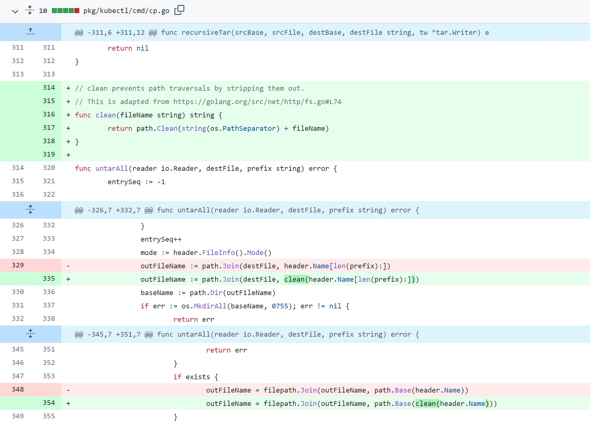

# 漏洞分析

## 一、漏洞基本信息

| Item           | Details                                          | Note              |
| -------------- | ------------------------------------------------ | ----------------- |
| Project        | Kubernetes                                       |                   |
| Publish Date   | 2018-04-06                                       |                   |
| Confirm        | https://github.com/kubernetes/kubernetes/issues/61297 |              |
| CVE-ID         | CVE-2018-1002100                                 | mitre, cvedetails |
| Exploits       | disclose                                         | see in image      |
| Affect Version | 1.5.x, 1.6.x, 1.7.x, 1.8.x, < 1.9.6              |                   |
| Fix Version    | 1.9.6                                            |                   |
| Fix Commit     | https://github.com/kubernetes/kubernetes/pull/61298/commits  |       |
| CVSS           | 4.2 CVSS:3.0/AV:N/AC:H/PR:H/UI:R/S:U/C:N/I:H/A:N |                   |
| Vuln’s Author  |                                                  |                   |


## 二、组件简介
kubectl是Kubernetes命令行工具，使得你可以对Kubernetes集群运行命令，如使用kubectl来部署应用、监测和管理集群资源以及查看日志等等

## 三、漏洞详情

### 1. 介绍
kubectl cp命令在从容器中拷贝数据到主机时，没有校验从容器中返回的tar数据，存在路径穿越漏洞，可覆盖主机上的任意文件

### 2. 影响
当从恶意镜像中往主机拷贝数据时，攻击者可利用恶意镜像覆盖主机任意文件，进而完成容器逃逸，控制宿主机

## 四、防御
禁止从不可信的镜像中往主机拷贝文件

## 五、漏洞复现
### 1. 复现环境
```
docker pull noirfate/vul-k8s-cve-2018-1002100:1.0
```
### 2. 复现过程
```
docker-compose up
ssh -p12222 root@127.0.0.1
cd exploit
./run
```

## 六、漏洞分析
问题出在`pkg/kubectl/cmd/cp.go`中，`destFile`是`kubectl cp`命令中指定的主机目录，
```go
func untarAll(reader io.Reader, destFile, prefix string) error {
	...
	tarReader := tar.NewReader(reader)
	for {
		header, err := tarReader.Next()
		...
		// 获取tar包中包含路径的完整文件名，然后和destFile拼接成最终往主机上写的文件名outFileName
		outFileName := path.Join(destFile, header.Name[len(prefix):])
		baseName := path.Dir(outFileName)
		...
		if mode&os.ModeSymlink != 0 {
			err := os.Symlink(header.Linkname, outFileName)
			if err != nil {
				return err
			}
		} else {
            // 写文件
			outFile, err := os.Create(outFileName)
			if err != nil {
				return err
			}
			defer outFile.Close()
			if _, err := io.Copy(outFile, tarReader); err != nil {
				return err
			}
			if err := outFile.Close(); err != nil {
				return err
			}
		}
	}
	...
}
```

## 七、漏洞修复分析
在tar包中的文件名前加路径分隔符，linux上就是`/`，使用[path.Clean](https://pkg.go.dev/path#Clean)函数清除`/`后面的`..`


## 八、漏洞挖掘方法与过程

## 九、同类问题挖掘方法

### 设计实现层

### Fuzz

### codeql

## 十、时间线

