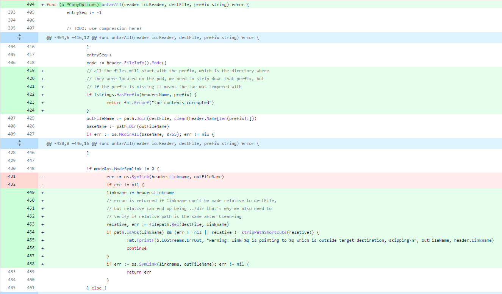

# 漏洞分析

## 一、漏洞基本信息

| Item           | Details                                          | Note              |
| -------------- | ------------------------------------------------ | ----------------- |
| Project        | Kubernetes                                       |                   |
| Publish Date   | 2019-03-04                                       |                   |
| Confirm        | https://github.com/kubernetes/kubernetes/pull/75037   |              |
| CVE-ID         | CVE-2019-1002101                                 | mitre, cvedetails |
| Exploits       | disclose                                         | see in image      |
| Affect Version | 1.11.0-1.11.8, 1.12.0-1.12.6, 1.13.0,1.13.4      |                   |
| Fix Version    | 1.11.9, 1.12.7, 1.13.5                           |                   |
| Fix Commit     | https://github.com/kubernetes/kubernetes/pull/75037/commits  |       |
| CVSS           | 5.5 CVSS:3.0/AV:L/AC:L/PR:N/UI:R/S:U/C:N/I:H/A:N |                   |
| Vuln’s Author  | Ariel Zelivansky (Twistlock)                     |                   |


## 二、组件简介
kubectl是Kubernetes命令行工具，使得你可以对Kubernetes集群运行命令，如使用kubectl来部署应用、监测和管理集群资源以及查看日志等等

## 三、漏洞详情

### 1. 介绍
kubectl cp命令在从容器中拷贝数据到主机时，没有校验从容器中返回的tar数据，可通过符号链接的方式实现路径穿越，覆盖主机上的任意文件

### 2. 影响
当从恶意镜像中往主机拷贝数据时，攻击者可利用恶意镜像覆盖主机任意文件，进而完成容器逃逸，控制宿主机

## 四、防御
禁止从不可信的镜像中往主机拷贝文件

## 五、漏洞复现
### 1. 复现环境
```
docker pull noirfate/vul-k8s-cve-2019-1002101:1.0
```
### 2. 复现过程
```
docker-compose up
ssh -p12222 root@127.0.0.1
cd exploit
./run
```

## 六、漏洞分析

[分析文章](https://unit42.paloaltonetworks.com/disclosing-directory-traversal-vulnerability-kubernetes-copy-cve-2019-1002101/)

## 七、漏洞修复分析

增加了两处校验，一是tar包中的文件名必须包含`prefix`，即拷贝时容器中的文件路径，二是校验符号链接必须不能是绝对路径且不能包含`..`，但第二处校验存在问题导致了之后的`CVE-2019-11246`

这个判断`if path.IsAbs(linkname) && (err != nil || relative != stripPathShortcuts(relative))`，如果`linkname`不是绝对路径，即第一个条件为假，由于是逻辑与的关系，第二个条件就不起作用了，无法阻止相对路径

## 八、漏洞挖掘方法与过程

## 九、同类问题挖掘方法

### 设计实现层

### Fuzz

### codeql

## 十、时间线

