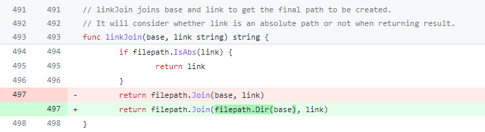

# 漏洞分析

## 一、漏洞基本信息

| Item           | Details                                          | Note              |
| -------------- | ------------------------------------------------ | ----------------- |
| Project        | Kubernetes                                       |                   |
| Publish Date   | 2019-08-05                                       |                   |
| Confirm        | https://github.com/kubernetes/kubernetes/issues/80984 |              |
| CVE-ID         | CVE-2019-11249                                   | mitre, cvedetails |
| Exploits       | unpublished                                      | see in image      |
| Affect Version | < 1.13.9, 1.14.0-1.14.4, 1.15.0-1.15.1           |                   |
| Fix Version    | 1.13.9, 1.14.5, 1.15.2                           |                   |
| Fix Commit     | https://github.com/kubernetes/kubernetes/pull/80871/commits  |       |
| CVSS           | 4.8 CVSS:3.0/AV:N/AC:H/PR:L/UI:R/S:U/C:N/I:H/A:N |                   |
| Vuln’s Author  | Yang Yang (Amazon)                               |                   |


## 二、组件简介
kubectl是Kubernetes命令行工具，使得你可以对Kubernetes集群运行命令，如使用kubectl来部署应用、监测和管理集群资源以及查看日志等等

## 三、漏洞详情

### 1. 介绍
kubectl cp命令在从容器中拷贝数据到主机时，没有校验从容器中返回的tar数据，可通过符号链接的方式实现路径穿越，覆盖主机上的任意文件

### 2. 影响
当从恶意镜像中往主机拷贝数据时，攻击者可利用恶意镜像覆盖主机任意文件，进而完成容器逃逸，控制宿主机

## 四、防御
禁止从不可信的镜像中往主机拷贝文件

## 五、漏洞复现
### 1. 复现环境
```
docker pull noirfate/vul-k8s-cve-2019-11249:1.0
```
### 2. 复现过程
```
docker-compose up
ssh -p12222 root@127.0.0.1
cd exploit
./run
```

## 六、漏洞分析
在检查路径穿越问题时使用了`linkJoin`函数来拼接链接文件名`destFileName`和链接目标`linkname`，如下所示：
```go
if mode&os.ModeSymlink != 0 {
	linkname := header.Linkname
	// We need to ensure that the link destination is always within boundries
	// of the destination directory. This prevents any kind of path traversal
	// from within tar archive.
	if !isDestRelative(destDir, linkJoin(destFileName, linkname)) {
		fmt.Fprintf(o.IOStreams.ErrOut, "warning: link %q is pointing to %q which is outside target destination, skipping\n", destFileName, header.Linkname)
		continue
	}
	if err := os.Symlink(linkname, destFileName); err != nil {
		return err
}

// linkJoin joins base and link to get the final path to be created.
// It will consider whether link is an absolute path or not when returning result.
func linkJoin(base, link string) string {
	if filepath.IsAbs(link) {
		return link
	}
	return filepath.Join(base, link)
}
```
`linkJoin`在进行拼接时，若`destFileName`不是绝对路径，则使用`filepath.Join(destFileName, linkname)`进行拼接，当`destFileName`不包含路径信息时，拼接结果会抹去`linkname`中的一层`..`，导致绕过校验，实现穿越到上级目录，即：`linkJoin("xxx", "../abc")`会返回`abc`

## 七、漏洞修复分析

在拼接时用`destFileName`的路径来代替`destFileName`本身，`linkJoin("xxx", "../abc")`就会返回`../abc`了


## 八、漏洞挖掘方法与过程

## 九、同类问题挖掘方法

### 设计实现层

### Fuzz

### codeql

## 十、时间线

