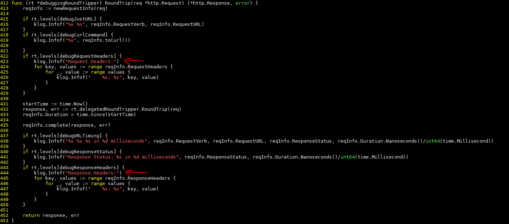

# 漏洞分析

## 一、漏洞基本信息

| Item           | Details                                          | Note              |
| -------------- | ------------------------------------------------ | ----------------- |
| Project        | Kubernetes                                       |                   |
| Publish Date   | 2019-08-28                                       |                   |
| Confirm        | https://github.com/kubernetes/kubernetes/issues/81114 |              |
| CVE-ID         | CVE-2019-11250                                   | mitre, cvedetails |
| Exploits       | disclose                                         | see in image      |
| Affect Version | <= 1.15.3                                        |                   |
| Fix Version    | 1.15.4                                           |                   |
| Fix Commit     | https://github.com/kubernetes/kubernetes/pull/81330/commits  |       |
| CVSS           | 4.7 CVSS:3.0/AV:L/AC:H/PR:L/UI:N/S:U/C:H/I:N/A:N |                   |
| Vuln’s Author  |                                                  |                   |


## 二、组件简介
Kubernetes API 服务器验证并配置 API 对象的数据， 这些对象包括 pods、services、replicationcontrollers 等。 API 服务器为 REST 操作提供服务，并为集群的共享状态提供前端， 所有其他组件都通过该前端进行交互

## 三、漏洞详情

### 1. 介绍
当`kube-apiserver`的日志级别设置到10时会在日志中记录`bearer token`，能够查看日志的人则可从日志中获取他人的凭证

### 2. 影响
当攻击者能够设置`kube-apiserver`的日志级别且能查看日志时，攻击者可从日志中获取他人的凭证

## 四、防御
日志级别小于等于6，且禁止设置日志级别

## 五、漏洞复现
### 1. 复现环境
```
docker pull noirfate/vul-k8s-cve-2019-11250:1.0
```
### 2. 复现过程
```
docker-compose up
ssh -p12222 root@127.0.0.1
cd exploit
./run
```

## 六、漏洞分析
此漏洞发生在`client-go`代码中，实际场景是`kube-apiserver`作为客户端去连`Aggregated APIServer`时会记录认证头。在这里复现时没有配`Aggregated APIServer`，而是获取`Response Body`中的`token`


## 七、漏洞修复分析
修复就是遮掩掉`token`信息

## 八、漏洞挖掘方法与过程

## 九、同类问题挖掘方法

### 设计实现层
由于`client-go`是共用的客户端代码，当`kube-apiserver`作为客户端时与kubectl无异，故可以通过设置kubectl的日志级别来看是否会泄露敏感信息，如`kubectl --v=10`

### Fuzz

### codeql

## 十、时间线

