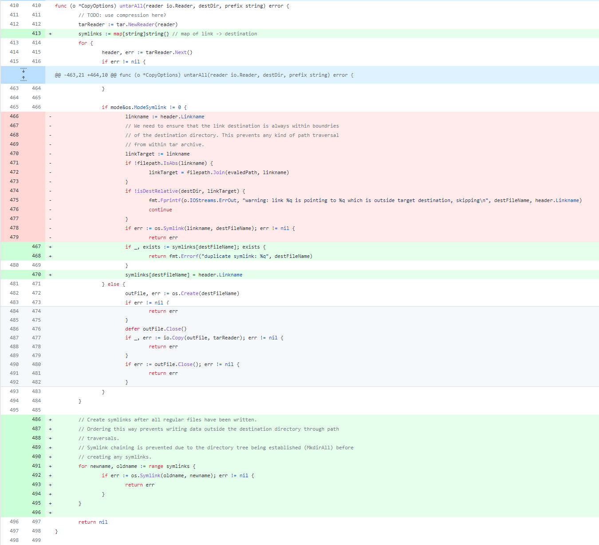

# 漏洞分析

## 一、漏洞基本信息

| Item           | Details                                          | Note              |
| -------------- | ------------------------------------------------ | ----------------- |
| Project        | Kubernetes                                       |                   |
| Publish Date   | 2019-09-19                                       |                   |
| Confirm        | https://github.com/kubernetes/kubernetes/issues/87773 |              |
| CVE-ID         | CVE-2019-11251                                   | mitre, cvedetails |
| Exploits       | unpublished                                      | see in image      |
| Affect Version | 1.13.0-1.13.10, 1.14.0-1.14.6, 1.15.0-1.15.3     |                   |
| Fix Version    | 1.13.11, 1.14.7, 1.15.4                          |                   |
| Fix Commit     | https://github.com/kubernetes/kubernetes/pull/82503/commits  |       |
| CVSS           | 4.8 CVSS:3.0/AV:N/AC:H/PR:L/UI:R/S:U/C:N/I:H/A:N |                   |
| Vuln’s Author  | Erik Sjolund (@eriksjolund)                      |                   |


## 二、组件简介
kubectl是Kubernetes命令行工具，使得你可以对Kubernetes集群运行命令，如使用kubectl来部署应用、监测和管理集群资源以及查看日志等等

## 三、漏洞详情

### 1. 介绍
kubectl cp命令在从容器中拷贝数据到主机时，没有校验从容器中返回的tar数据，可通过符号链接的方式实现路径穿越，覆盖主机上的任意文件

### 2. 影响
当从恶意镜像中往主机拷贝数据时，攻击者可利用恶意镜像覆盖主机任意文件，进而完成容器逃逸，控制宿主机

## 四、防御
禁止从不可信的镜像中往主机拷贝文件

## 五、漏洞复现
### 1. 复现环境
```
docker pull noirfate/vul-k8s-cve-2019-11251:1.0
```
### 2. 复现过程
```
docker-compose up
ssh -p12222 root@127.0.0.1
cd exploit
./run
```

## 六、漏洞分析

若链接目标`linkname`本身为符号链接时，`linkTarget = filepath.Join(evaledPath, linkname)`未取`linkname`真实的路径，导致`Join`之后产生路径穿越的问题
```go
baseName := filepath.Dir(destFileName)
evaledPath, err := filepath.EvalSymlinks(baseName)
if mode&os.ModeSymlink != 0 {
	linkname := header.Linkname
	// We need to ensure that the link destination is always within boundries
	// of the destination directory. This prevents any kind of path traversal
	// from within tar archive.
	linkTarget := linkname
	if !filepath.IsAbs(linkname) {
		linkTarget = filepath.Join(evaledPath, linkname)
	}
	if !isDestRelative(destDir, linkTarget) {
		fmt.Fprintf(o.IOStreams.ErrOut, "warning: link %q is pointing to %q which is outside target destination, skipping\n", destFileName, header.Linkname)
		continue
	}
	if err := os.Symlink(linkname, destFileName); err != nil {
		return err
}
```

利用场景：拷贝文件到当前路径`.`，创建目录`./test_link`，在`test_link`下创建符号链接`link1`指向`..`，此时`link1`实际指向的路径为`.`，没有发生穿越。再在`test_link`下创建符号链接`link2`，`link2`指向`link1/..`，此时`destFileName`为`test_link/link2`，baseName为`test_link`，`evaledPath`为`test_link`，`Join`之后的`linkTarget`test\_link`，绕过了`isDestRelative`检查

## 七、漏洞修复分析

修复方式为禁止重名符号链接和把创建符号链接放到最后，这样就可以防止修改符号链接或往符号链接指向的文件写数据


## 八、漏洞挖掘方法与过程

## 九、同类问题挖掘方法

### 设计实现层

### Fuzz

### codeql

## 十、时间线

